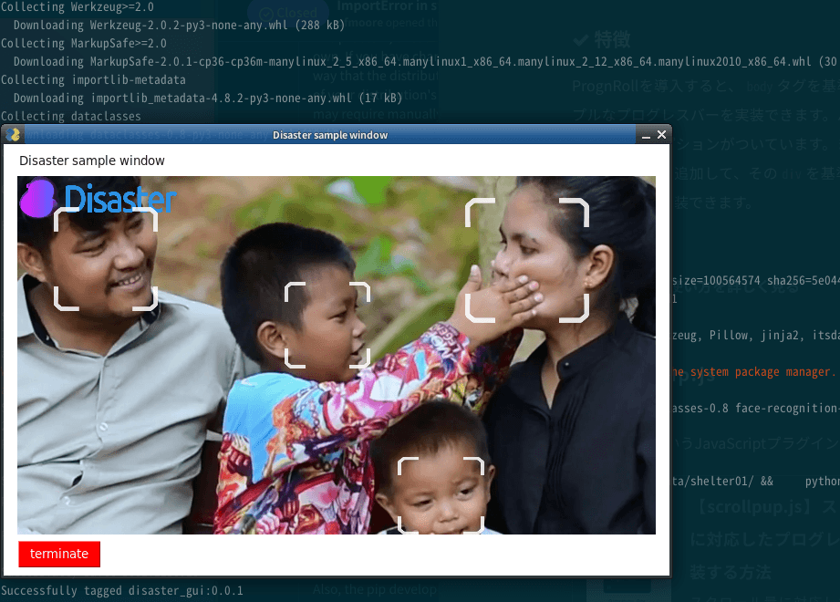
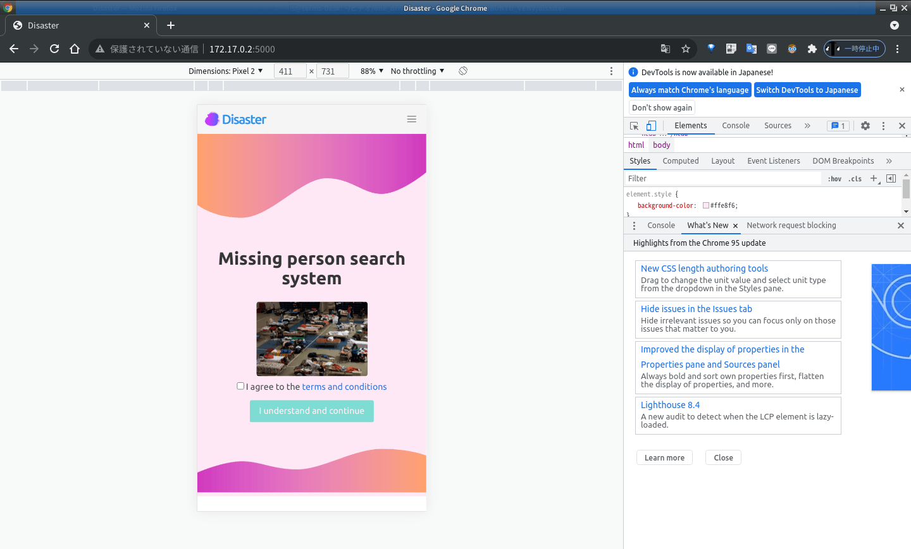

# How to use Docker
If you do not have the nvidia-docker2 package installed, the operating speed is extremely slow. However, if you just want to try Disaster, I think you can leave it as it is.  
In that case, please use "Dockerfile".  
  
If you want to run Disaster at normal processing speed but do not have nvidia-docker2 package installed, please do the following.  
```bash:Install nvidia-docker2 package
# For Ubuntu 18.04
distribution=$(. /etc/os-release;echo $ID$VERSION_ID) && \
curl -s -L https://nvidia.github.io/nvidia-docker/gpgkey | sudo apt-key add - && \
curl -s -L https://nvidia.github.io/nvidia-docker/$distribution/nvidia-docker.list | sudo tee /etc/apt/sources.list.d/nvidia-docker.list

sudo apt update
sudo apt install -y nvidia-docker2
sudo systemctl restart docker
```
For instructions on how to install the nvidia-docker2 package on each Linux distribution, see the official documentation installation guide.  
https://docs.nvidia.com/datacenter/cloud-native/container-toolkit/install-guide.html#installing-docker-ce  
  
Also, use "Dockerfile_GPU" for the Dockerfile. In that case, change the file name from Dockerfile_GPU to Dockerfile.

## Make sure you have git and Docker installed.
```bash:
$ which git
/usr/bin/git

$ which docker
/usr/bin/docker
```

## Download Disaster
```bash
$ git clone https://github.com/yKesamaru/disaster.git
$ cd disaster
```
## Make image from dockerfile
### If you use nvidia-docker2 package
```bash
$ docker build -t disaster_gpu:0.0.1 .
```
### If you do not use nvidia-docker2 package
```bash
$ docker build -t disaster:0.0.1 .
```
## Check the completed image
```bash
$ docker images
REPOSITORY                            TAG              IMAGE ID       CREATED          SIZE
disaster_gpu                          0.0.1            b6eafa258728   19 minutes ago   2.2GB
```
## Start Disaster web application
### If you use nvidia-docker2 package
Start Disaster as a web application.
```bash:Allow access to the X server from localhost.
$ xhost +local:
```

```bash:If you have nvidia-docker2 package installed
$ docker run --gpus all --rm -it -e DISPLAY=$DISPLAY -v /tmp/.X11-unix/:/tmp/.X11-unix: disaster_gpu:0.0.1
```


Access <strong> http://172.17.0.2:5000/ </strong> with your browser.  


### If you do not use nvidia-docker2 package
Start Disaster.
```bash:Allow access to the X server from localhost.
$ xhost +local:
```
```bash:If you don't have nvidia-docker2 package installed
$ docker run --rm -it -e DISPLAY=$DISPLAY -v /tmp/.X11-unix/:/tmp/.X11-unix: disaster:0.0.1
 * Serving Flask app 'main.py' (lazy loading)
 * Environment: production
   WARNING: This is a development server. Do not use it in a production deployment.
   Use a production WSGI server instead.
 * Debug mode: off
 * Running on all addresses.
   WARNING: This is a development server. Do not use it in a production deployment.
 * Running on http://172.17.0.2:5000/ (Press CTRL+C to quit)
```

## When quitting Disaster web application
Press `Cnt + c` to exit.  

```bash
***@***:~/***/disaster$ docker run --rm -it -e DISPLAY=$DISPLAY -v /tmp/.X11-unix/:/tmp/.X11-unix: disaster_gpu:0.0.1
 * Serving Flask app 'main.py' (lazy loading)
 * Environment: production
   WARNING: This is a development server. Do not use it in a production deployment.
   Use a production WSGI server instead.
 * Debug mode: off
 * Running on all addresses.
   WARNING: This is a development server. Do not use it in a production deployment.
 * Running on http://172.17.0.2:5000/ (Press CTRL+C to quit)
^C

```

## Start Disaster GUI application
```bash
***@***:~/***/disaster$ docker run --rm -it -e DISPLAY=$DISPLAY -v /tmp/.X11-unix/:/tmp/.X11-unix: disaster_gpu:0.0.1 /bin/bash
root@f6b87a4fde6b:~/disaster# cd create_face_data/shelter01
root@f6b87a4fde6b:~/disaster/create_face_data/shelter01# python3 ./create_face_data_app.py 

```


Don't forget `xhost -local:`.  
```bash
***@***:~/***/disaster$ xhost -local:
non-network local connections being removed from access control list
```
  

# About the appearance
## Responsive design mode  
If you access http://172.17.0.2:5000/ with a browser, the display will be as follows.   
  
Turn on browser's responsive design mode.  
  

# Upload photos
Photos for the experiment are attached in advance.
These photos are `disaster/photos`.


