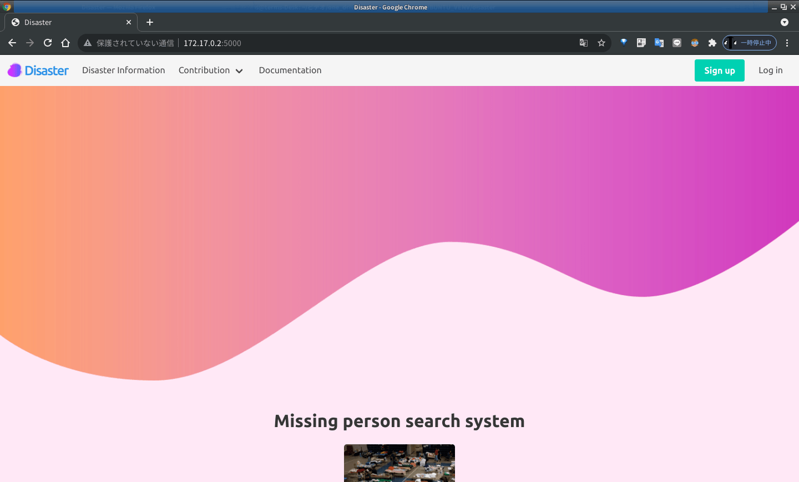

# How to use Docker
The attached Dockerfile does not support cuda. Therefore, the operating speed is extremely slow. However, if you just want to try Disaster, I recommend using Docker. 
## Make sure you have git and Docker installed.
```bash:
$ which git
/usr/bin/git

$ which docker
/usr/bin/docker
```

## Download Disaster
```bash
$ git clone https://github.com/yKesamaru/disaster.git
$ cd disaster
```
## Make image from dockerfile
```bash
$ dockebuild -t disaster_gui:0.0.1 .
```
## Check the completed image
```bash
$ docker images
REPOSITORY                            TAG              IMAGE ID       CREATED          SIZE
disaster_gui                          0.0.1            b6eafa258728   19 minutes ago   2.2GB
```
## Start Disaster
Start Disaster as a GUI application.
```bash:Allow access to the X server from localhost.
$ xhost +local:
```

```bash
$ docker run --rm -it -e DISPLAY=$DISPLAY -v /tmp/.X11-unix/:/tmp/.X11-unix: disaster:0.0.1
 * Serving Flask app 'main.py' (lazy loading)
 * Environment: production
   WARNING: This is a development server. Do not use it in a production deployment.
   Use a production WSGI server instead.
 * Debug mode: off
 * Running on all addresses.
   WARNING: This is a development server. Do not use it in a production deployment.
 * Running on http://172.17.0.2:5000/ (Press CTRL+C to quit)
```
First, a window for creating face vector data opens.  


After the window closes, access <strong> http://172.17.0.2:5000/ </strong> with your browser.  


## Disasterを終了する場合
`Cnt + c`を押して終了します。`xhost`を元に戻すことを忘れないようにします。
```bash
terms@terms-Desk:~/***/disaster$ docker run --rm -it -e DISPLAY=$DISPLAY -v /tmp/.X11-unix/:/tmp/.X11-unix: disaster_gui:0.0.1
 * Serving Flask app 'main.py' (lazy loading)
 * Environment: production
   WARNING: This is a development server. Do not use it in a production deployment.
   Use a production WSGI server instead.
 * Debug mode: off
 * Running on all addresses.
   WARNING: This is a development server. Do not use it in a production deployment.
 * Running on http://172.17.0.2:5000/ (Press CTRL+C to quit)
^C
terms@terms-Desk:~/***/disaster$ xhost -local:
non-network local connections being removed from access control list
```

# About the appearance
## Responsive design mode  
If you access http://172.17.0.2:5000/ with a browser, the display will be as follows.   
  
Turn on browser's responsive design mode.  
  

# Upload photos
Photos for the experiment are attached in advance.
These photos are `disaster/photos`.


